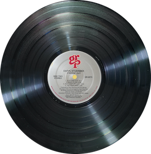
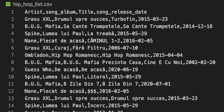
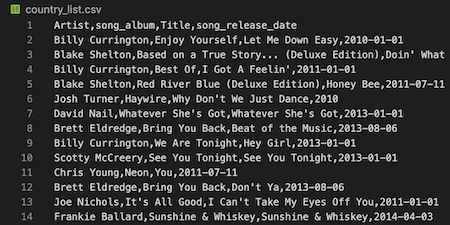

# sound_effects
Creating set lists from Spotify playlists with Python

## Looking for love in Spotify
The purpose of this project is to retrieve playlists for romantic songs in various categories from the Spotify Developer API and use the playlists to curate a master list of songs based on playlist results as the basis for other projects. The script produced a list of over 2,000 songs based on 50 playlists with the search term "Country Romance" and 800 songs for "Hip Hop Romance". 

## Spotify API
There is quite a bit that can be retrieved and the documentation provides some opportunities to explore results based on query types.
Developer API documentation for  <a href='https://developer.spotify.com/documentation/web-api/reference/search/search/#writing-a-query---guidelines'>Spotify</a>

## How to use
- Create a developer account on Spotify to obtain credentials.
- Clone or fork this repository and create a file named config.py to hold the above in the following variables: "clientId" and "clientSecret"
- Adjust search parameters, the default being "hip hop romance"
- The script will retrieve 50 playlists basic information for the songs within and store in a CSV file

## Folder structure
- docs folder holds explanation webpage
- script in spc.py and config.py should be placed here
- files contains the CSV and JSON files produced as a result of running the script.

## Webpage
The webpage for this project is here: <a href='https://sherirosalia.github.io/sound_effects/'> sound_effects </a>

## Related project
The lyrics for the song lists were pulled using the Genius API and the code is here: <a href='https://github.com/sherirosalia/cupid_shuffle'>cupid_shuffle </a>

## "Love and Hip Hop"

## "Country Romance"

